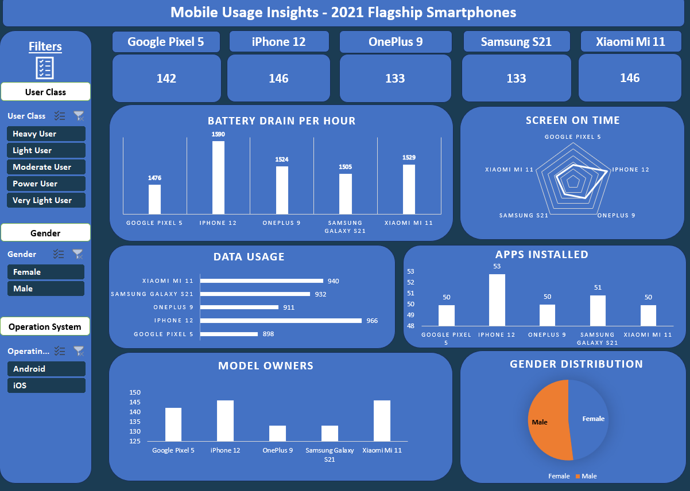
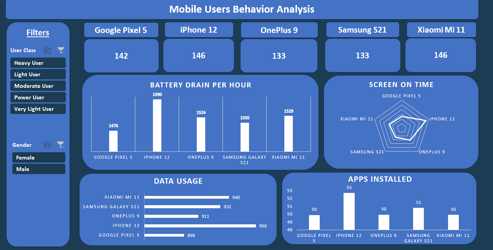

# 📱 User Behavior Analysis Dashboard (Excel + Power Pivot Project)

This project analyzes user behavior patterns across smartphones released in **2021**, using a real dataset inside Excel. The analysis focuses on daily app usage, screen-on time, battery consumption, and more — all visualized in an **interactive dashboard**.

## 📊 Dataset Overview

The dataset contains detailed data on:

- **User ID**
- **Device Model** (Smartphones from 2021)
- **Operating System**
- **App Usage Time (min/day)**
- **Screen On Time (hours/day)**
- **Battery Drain (mAh/day)**
- **Number of Apps Installed**
- **Data Usage (MB/day)**
- **Age**
- **Gender**
- **User Behavior Class**: Light / Moderate / Heavy

## ⚙️ Tools & Techniques Used

- ✅ **Microsoft Excel**
- ✅ **Power Pivot**
- ✅ **Pivot Tables**
- ✅ **Slicers & KPIs**
- ✅ **Interactive Dashboard Design**

## 📈 Dashboard & Insights

The Excel Dashboard allows users to interactively:

- Filter by device model, OS, gender, and behavior class
- Explore key KPIs by user type
- Analyze the relationship between screen time, app usage, and battery usage

## 🖼️ Dashboard Preview

### 🔍 Key Insights

1. **Google Pixel 5** had the **lowest battery consumption** among heavy users, with an average of **2677 mAh per hour**.
2. **iPhone 12** showed the **highest battery consumption** for heavy users, at **2728 mAh per hour**.
3. **OnePlus 9** had the **lowest mobile data usage** among heavy users.
4. The majority of **moderate users** were **female**.
5. There is a **strong correlation** between **screen-on time** and **battery drain**.

## 📂 File Structure

      📁 user_behavior_dataset.xlsx
        ├── User_Behavior (Raw Data)
        ├── Pivot (Aggregated metrics using Power Pivot)
        └── Dashboard (Interactive Excel dashboard)

---

> 🔧 Created using Microsoft Excel + Power Pivot  
> 📅 Focused on smartphones released in 2021  
> 👨‍💻 By [Hossam Ali]

